<p align="center">
  
</p>

# sMac ver 1.0
Scala early Macintosh computers emulator

<p align="center">
  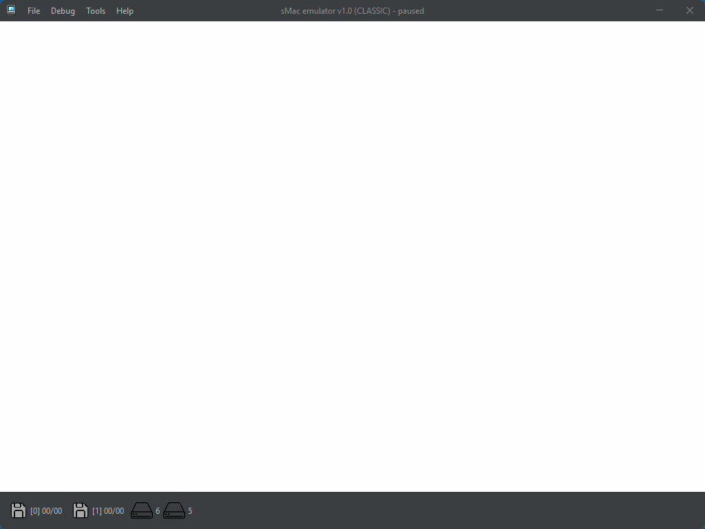
</p>

## Emulator main features
-----------
- Systems
  - 128K/512K
  - Plus (1M, 2M, 4M)
  - SE (1M, 2M, 4M)
  - SE FDHD  (1M, 2M, 4M)
  - Classic  (1M, 2M, 4M)
- Storage
  - Floppy
    - 400K, 800K read/write GCR encoding
    - 720K, 1440K read/write (SE FDHD, Classic only) GCR/MFM encoding
    - Image formats
      - raw
      - DC42 (read only)
      - MOOF
  - SCSI hard disks (with or without partitions information)
- Video display 512x342
- Mouse (via Z8530)
- ADB Mouse
- Keyboard (standard and ADB): M0110, M0110A, M0115
- RTC
- Z8530 (just for mouse support)
- NCR5380
- VIA
- IWM/SWIM disk controller
- Audio
- Integrated 68K debugger
- Performance monitor

## Usage
Go to https://github.com/abbruzze/sMac/releases/latest and download and unzip on your computer the latest version.
Be sure to have a jre (17 or above, best performance on 22) in the path and launch in the bin directory:
- On Windows: **smac.bat**
- On Linux: **smac.sh**

The emulator can be launched in two ways:
 1) from the command line:
   - `smac.bat/smac.sh --rom <rom file> <other options>` or
   - `smac.bat/smac.sh <configuration file>` where the configuration file is a text file under config directory where on each row you can put a command line option or option value. This is a convenient way to run a specific configuration multiple times. Example:
   ```
    --skip-mem-test
    --rom
    G:\My Drive\1990-10 - A49F9914 - Mac Classic.rom
    --scsi-6
    C:\Users\sMac\os755.dsk
    --scsi-5
    C:\Users\sMac\HD20_512-MacPlus.hda
   ```
   - command line options:
   
   | Option       | Description                                                                  |
   |--------------|------------------------------------------------------------------------------|
   | --rom        | rom image path                                                               |
   | --scsi-6     | set scsi 6 HD image                                                          |
   | --scsi-5     | set scsi 5 HD image                                                          |
   | --scsi-4     | set scsi 4 HD image                                                          |
   | --scsi-3     | set scsi 3 HD image                                                          |
   | --scsi-2     | set scsi 2 HD image                                                          |
   | --scsi-1     | set scsi 1 HD image                                                          |
   | --scsi-0     | set scsi 0 HD image                                                          |
   | --floppy-0   | set floppy 0 image                                                           |
   | --floppy-1   | set floppy 1 image                                                           |
   | --floppy-2   | set floppy 2 image                                                           |
   | --memory     | set the amount of memory, expressed in Kbytes or Mbytes. Examples: 128k 2M 4M |
   | --auto-warp  | enabled automatically warp mode when accessing floppies|
   | --skip-mem-test | skip initial memory test|
   | --keyboard-config-file| keyboard configuration file |

2) double click on the .bat/.sh icon or run the script without parameters:
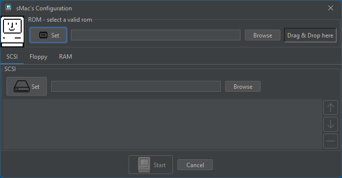
here you can drag & drop the rom file, the HD SCSI images, the floppy images and configure ram size.

## Supported ROMS
 | ROM type      |MD5|
|---------------|---|
 | 128K, 512K    |DB7E6D3205A2B48023FBA5AA867AC6D6|
 | 128K, 512K V1 |1D7F52D2D490524954F6AFCE083D9593|
 | PLUS V1       |4D8D1E81FA606F57C7ED7188B8B5F410|
 | PLUS V2       |16B516E13918A439CF9031EC24353610|
 | PLUS V3       |8A41E0754FFD1BB00D8183875C55164C|
 | SE            |9FB38BDCC0D53D9D380897EE53DC1322|
 | SE FDHD       |886444D7ABC1185112391B8656C7E448|
 | CLASSIC       |C229BB677CB41B84B780C9E38A09173E|

## Keyboard settings
By default, the emulator loads the keyboard configuration file config/keyboard.conf that defines the key bindings.
It can be used another configuration file using --keyboard-config-file <file> where file is located under config.
The default bindings is for Italian keyboard.
Follows the keyboard.conf default configuration file:
```yaml
# sMac keyboards definition file: Italian binding
# 
# Each keyboard must be defined with 
# <keyboard id> { 
# 	<definitions>
#		..
#	<definitions>			
# }
#
# On each <definitions> row a list of Java extended key codes must be written separated by space(s)
# Key codes can be expressed as decimal/hex values or with a KeyEvent's class mnemonic (see https://docs.oracle.com/en/java/javase/22/docs/api/java.desktop/java/awt/event/KeyEvent.html)
# Each definitions' row must follow strictly the length of the # template above
#
#
# M0110 keyboard definitions
M0110 {
	# |  `|  1|  2|  3|  4|  5|  6|  7|  8|  9|  0|  -|  =|Backs|
	0x10000f2 VK_1 VK_2 VK_3 VK_4 VK_5 VK_6 VK_7 VK_8 VK_9 VK_0 0x10000ec 0x10000f9 VK_BACK_SPACE
	# |Tab  |  Q|  W|  E|  R|  T|  Y|  U|  I|  O|  P|  [|  ]|  \|
	VK_TAB VK_Q VK_W VK_E VK_R VK_T VK_Y VK_U VK_I VK_O VK_P 0x10000e8 VK_PLUS VK_BACK_SLASH
	# |CapsLo|  A|  S|  D|  F|  G|  H|  J|  K|  L|  ;|  '|Return|
	VK_CAPS_LOCK VK_A VK_S VK_D VK_F VK_G VK_H VK_J VK_K VK_L 0x10000e0 VK_QUOTE VK_ENTER
	# |Shift   |  Z|  X|  C|  V|  B|  N|  M|  ,|  .|  /|        |
	VK_SHIFT VK_Z VK_X VK_C VK_V VK_B VK_N VK_M VK_COMMA VK_PERIOD VK_MINUS
	# |Opt|Mac |         Space               |Enter|Opt|
	VK_LESS VK_CONTROL VK_SPACE VK_INSERT VK_LESS
}

# M0110A keyboard definitions
M0110A {
	# |  `|  1|  2|  3|  4|  5|  6|  7|  8|  9|  0|  -|  =|Backs|Clr|  =|  /|  *|
	0x10000f2 VK_1 VK_2 VK_3 VK_4 VK_5 VK_6 VK_7 VK_8 VK_9 VK_0 0x10000ec 0x10000f9 VK_BACK_SPACE VK_HOME VK_END VK_DIVIDE VK_MULTIPLY
	# |Tab  |  Q|  W|  E|  R|  T|  Y|  U|  I|  O|  P|  [|  ]|   |  7|  8|  9|  -|
	VK_TAB VK_Q VK_W VK_E VK_R VK_T VK_Y VK_U VK_I VK_O VK_P 0x10000e8 VK_PLUS VK_NUMPAD7 VK_NUMPAD8 VK_NUMPAD9 VK_SUBTRACT
	# |CapsLo|  A|  S|  D|  F|  G|  H|  J|  K|  L|  ;|  '|Return|  4|  5|  6|  +|
	VK_CAPS_LOCK VK_A VK_S VK_D VK_F VK_G VK_H VK_J VK_K VK_L 0x10000e0 VK_QUOTE VK_ENTER VK_NUMPAD4 VK_NUMPAD5 VK_NUMPAD6 VK_ADD
	# |Shift |  Z|  X|  C|  V|  B|  N|  M|  ,|  .|  /|Shft|Up   |  1|  2|  3|
	VK_SHIFT VK_Z VK_X VK_C VK_V VK_B VK_N VK_M VK_COMMA VK_PERIOD VK_MINUS VK_SHIFT VK_UP VK_NUMPAD1 VK_NUMPAD2 VK_NUMPAD3
	# |Optio|Mac    |           Space           |  \|Lft|Rgt|Dn |      0|  .|   |
	VK_LESS VK_CONTROL VK_SPACE VK_BACK_SLASH VK_LEFT VK_RIGHT VK_DOWN VK_NUMPAD0 VK_DECIMAL
}

# M0115 keyboard definitions
M0115 {
	# |Esc|   |F1 |F2 |F3 |F4 | |F5 |F6 |F7 |F8 | F9 |F10|F11|F12|                        |Pwr|
	VK_ESCAPE VK_F1 VK_F2 VK_F3 VK_F4 VK_F5 VK_F6 VK_F7 VK_F8 VK_F9 VK_F10 VK_F11 VK_F12 VK_PAUSE
	# |  `|  1|  2|  3|  4|  5|  6|  7|  8|  9|  0|  -|  =|Delete |Hlp|Hom|PgU|NmL|   |  /|  *|
	0x10000f2 VK_1 VK_2 VK_3 VK_4 VK_5 VK_6 VK_7 VK_8 VK_9 VK_0 0x10000ec 0x10000f9 VK_BACK_SPACE VK_INSERT VK_HOME VK_PAGE_UP VK_NUM_LOCK VK_DIVIDE VK_MULTIPLY
	# |Tab  |  Q|  W|  E|  R|  T|  Y|  U|  I|  O|  P|  [|  ]|  \  |Del|End|PgD|  7|  8|  9|  -|
	VK_TAB VK_Q VK_W VK_E VK_R VK_T VK_Y VK_U VK_I VK_O VK_P 0x10000e8 VK_PLUS VK_BACK_SLASH VK_DELETE VK_END VK_PAGE_DOWN VK_NUMPAD7 VK_NUMPAD8 VK_NUMPAD9 VK_SUBTRACT
	# |CapsLo|  A|  S|  D|  F|  G|  H|  J|  K|  L|  ;|  "|Return  |           |  4|  5|  6|  +|
	VK_CAPS_LOCK VK_A VK_S VK_D VK_F VK_G VK_H VK_J VK_K VK_L 0x10000e0 VK_QUOTE VK_ENTER VK_NUMPAD4 VK_NUMPAD5 VK_NUMPAD6 VK_ADD
	# |Shift   |  Z|  X|  C|  V|  B|  N|  M|  ,|  .|  /|              |Up |   |  1|  2|  3|   |
	VK_SHIFT VK_Z VK_X VK_C VK_V VK_B VK_N VK_M VK_COMMA VK_PERIOD VK_MINUS VK_UP VK_NUMPAD1 VK_NUMPAD2 VK_NUMPAD3
	# |Ctrl |Opt |Gui  |        Space          |                  |Lef|Rig|Dow|   0   |  .|   |
	VK_ALT_GRAPH VK_LESS VK_CONTROL VK_SPACE VK_LEFT VK_RIGHT VK_DOWN VK_NUMPAD0 VK_DECIMAL
}

```
# Debugger
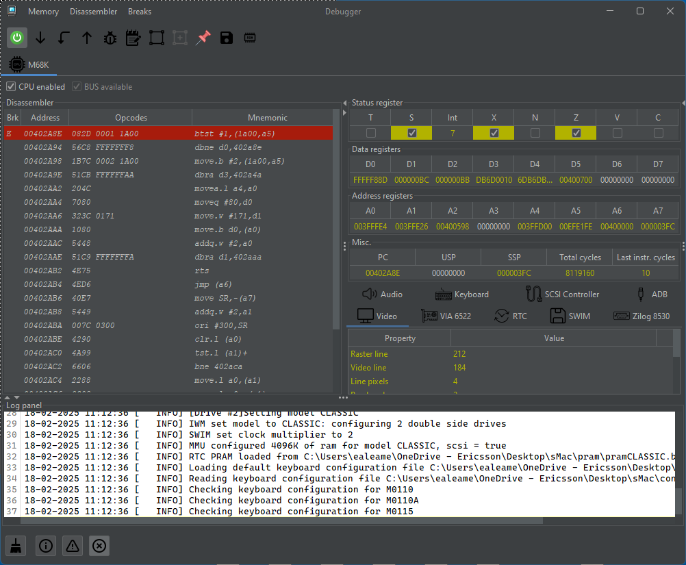
- Breakpoints
- RAM/ROM inspection
- Components inspection (VIA, RTC, IWM, etc.)

# Gallery
Take on me: Flim with music
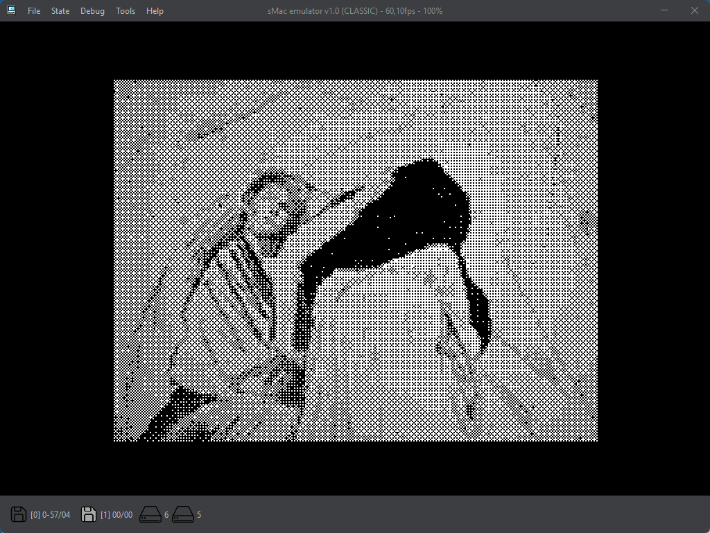

Performance monitor
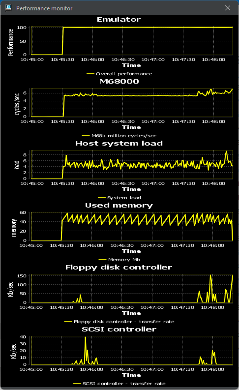
|                                                |                             |                                           |
|------------------------------------------------|-----------------------------|-------------------------------------------|
| 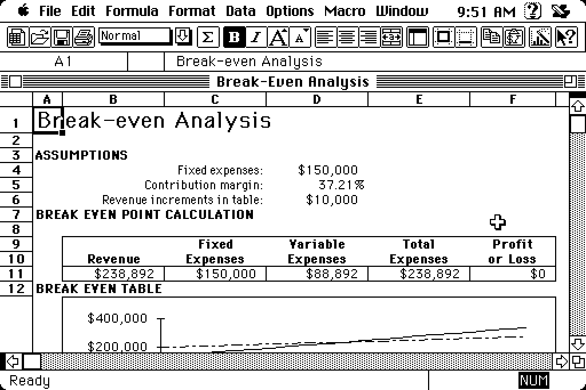                | 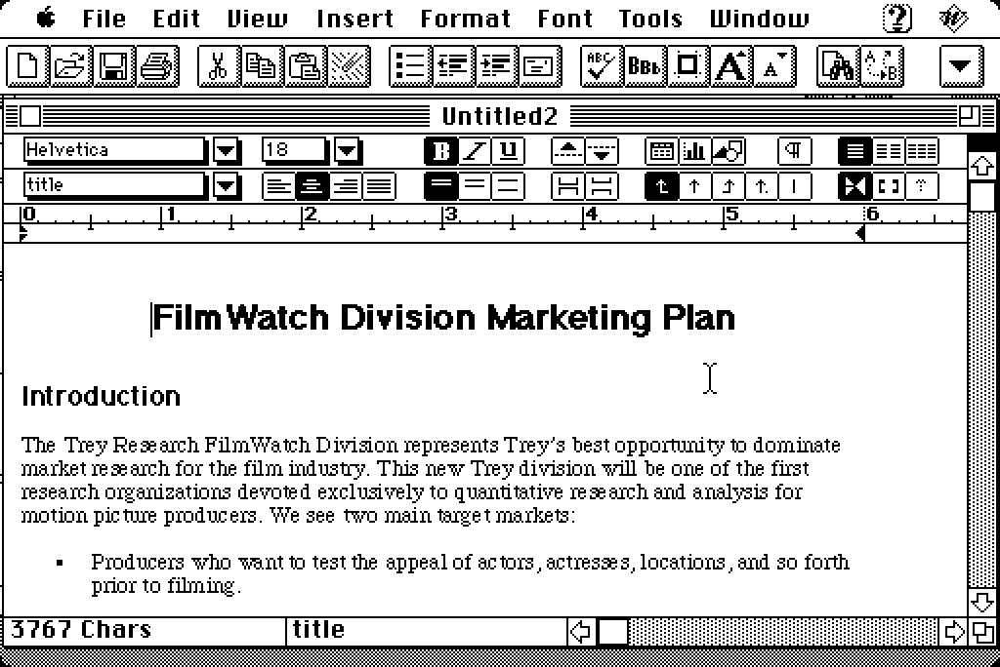 | 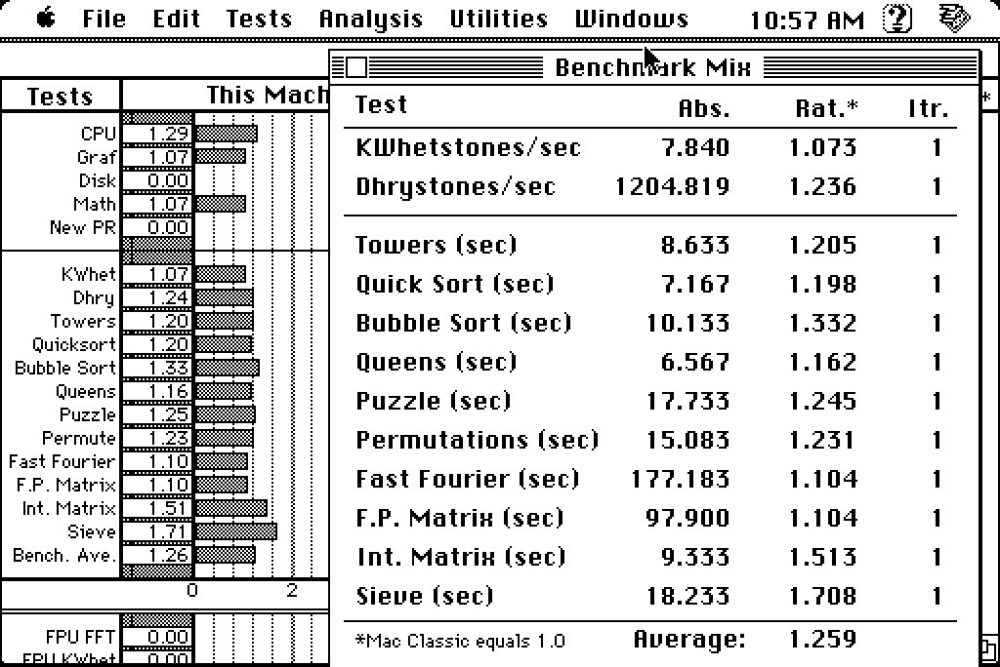 |
|         | 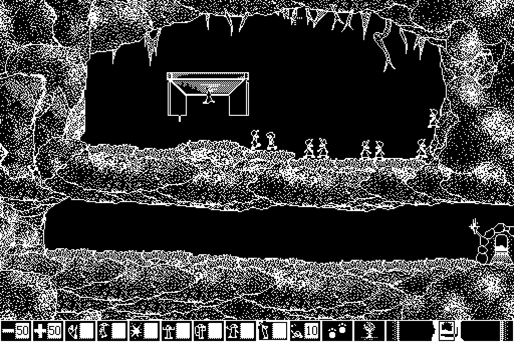 | 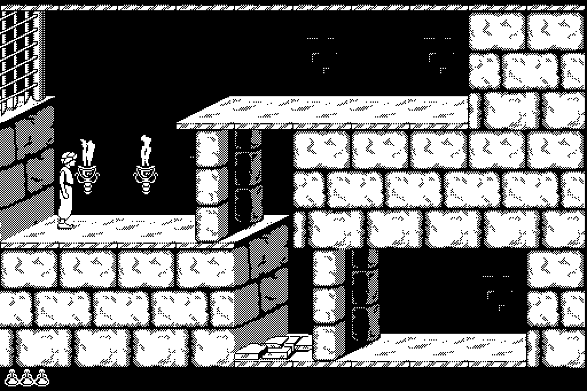 |
| 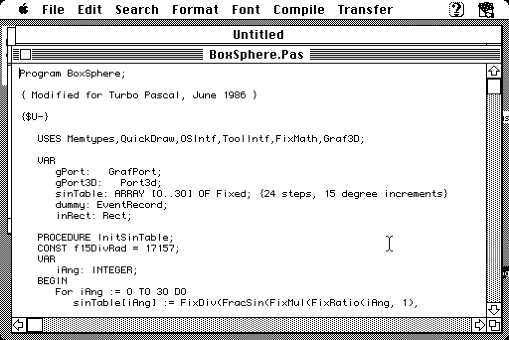 | 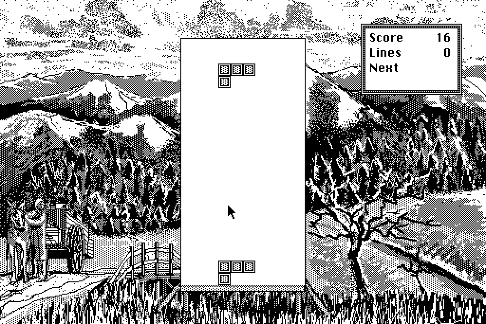 | 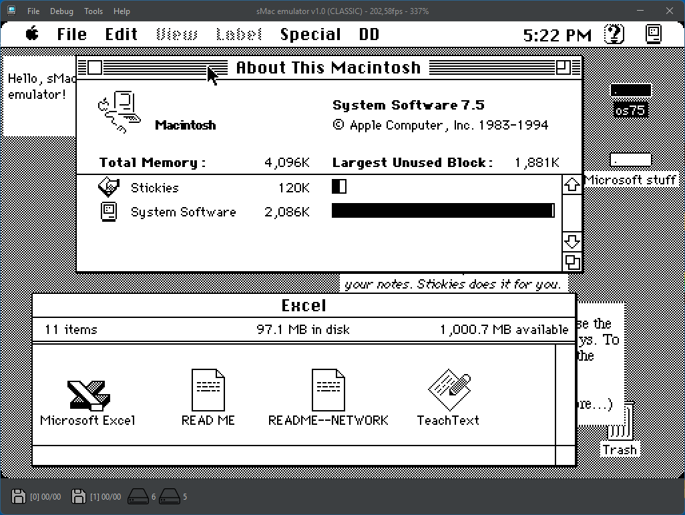     |


